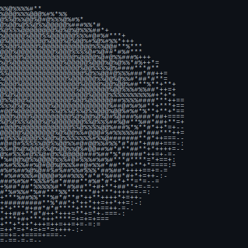

  

 

 

<h2 align="center">⌜ Know About Me ⌟</h2>

<table>
<tr>
<td width="65%" valign="top">

 

**Hey! Eu sou o Filippe.**

Analista de TI movido a café e temas dark minimalistas. De dia, mergulho em **Oracle PL/SQL e no ecossistema Winthor**, mantendo dados íntegros e operações rodando. De noite, escrevo **Node.js, TypeScript e Python** para automatizar tudo que me faça sair do trabalho manual.

- 🎓 5º semestre de Análise e Desenvolvimento de Sistemas
- 🎯 Migrando de sustentação para **Backend / Fullstack**
- ⚙️ Construindo automações que evitam que os problemas aconteçam
- 🧠 Estudando arquitetura de aplicações escaláveis

</td>
<td width="35%" align="center" valign="middle">

</td>
</tr>
</table>

 

<h2 align="center">⌜ Top Projects ⌟ (built to avoid manual labor)</h2>

<table>
<tr>
<td align="right" width="35%">

</td>
<td align="left" width="65%">Ambiente completo de dev — scripts, configs, aliases e produtividade.</td>
</tr>
<tr>
<td align="right">

</td>
<td align="left">Scripts SQL para automações e rotinas Oracle/Winthor, porque repetir query é crime.</td>
</tr>
</table>

 

<h2 align="center">⌜ ⛧ Languages · Frameworks · Tools ⛧ ⌟</h2>

 

 

<h2 align="center">⌜ 📊 GitHub Stats ⌟</h2>

  

 

<h2 align="center">⌜ 🐍 Contribution Snake ⌟</h2>

 

<h2 align="center">⌜ Connect ⌟</h2>

 

---

